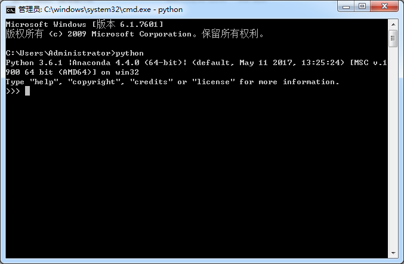

在学习python前，需要准备些什么。

1. 安装Python3并且配置好环境
    python3官网网站：https://www.python.org/
    强烈建议直接使用 Anaconda (可以少走些弯路，节省点时间。)：https://www.anaconda.com/download/
    安装好python3后 大概是这样子的
    

2. 你需要一款编辑器 或者 IDE 用于编写你的 python 代码。
    这里推荐几款常见的: 1.sublimeText 2.pycharm 3.vscode 4.VIM ………………
    自己觉得哪一款比较好用就用哪个就好了，具体下载链接我就不放出来了。
    可以百度搜索。
    